# 🛰️ Airspy R2 — Optimisations Firmware LEO Satellite

<p align="center">
  
  
  
  
  
</p>

---

> **Objectif** : Maximiser la sensibilité de réception de l'Airspy R2 pour les signaux faibles des satellites LEO (NOAA, Meteor, CubeSats, ISS, HRPT).
> Toutes les modifications sont réversibles par reflash ou DFU.

---

## 📋 Table des matières

- [🏗️ Architecture matérielle](#-architecture-matérielle)
- [📡 Chaîne RF complète](#-chaîne-rf-complète)
- [🛰️ Caractéristiques des signaux LEO](#-caractéristiques-des-signaux-leo)
- [🔧 Modifications appliquées](#-modifications-appliquées)
  - [⚡ Mod 1 — Gain filtre IF +3dB (R0x06)](#-modification-1--gain-filtre-if-3db-r0x06)
  - [⚡ Mod 2 — Courant mixer maximal (R0x07)](#-modification-2--courant-mixer-maximal-r0x07)
  - [⚡ Mod 3 — Courant filtre IF maximal (R0x09)](#-modification-3--courant-filtre-if-maximal-r0x09)
  - [⚡ Mod 4 — Seuils AGC LNA relevés (R0x0D)](#-modification-4--seuils-agc-lna-relevés-r0x0d)
  - [⚡ Mod 5 — Seuil AGC mixer relevé (R0x0E)](#-modification-5--seuil-agc-mixer-relevé-r0x0e)
  - [⚡ Mod 6 — TOP mixer plus élevé (R0x1C)](#-modification-6--top-mixer-plus-élevé-r0x1c)
  - [⚡ Mod 7 — TOP LNA plus élevé (R0x1D)](#-modification-7--top-lna-plus-élevé-r0x1d)
  - [⚡ Mod 8 — FILTER_EXT activé (R0x1E)](#-modification-8--filter_ext-activé-r0x1e)
  - [⚡ Mod 9 — OPTIM_SET_MUX (Makefile)](#-modification-9--optim_set_mux-makefile)
  - [⚡ Mod 10 — CLK7 drive 8mA (SI5351C)](#-modification-10--clk7-drive-8ma-si5351c)
- [�️ GPSDO — Référence externe 10 MHz](#-gpsdo--référence-externe-10-mhz)
  - [⚡ Mod 11 — CLK7 8mA en mode CLKIN](#-modification-11--clk7-8ma-en-mode-clkin-gpsdo)
- [📊 Tableau récapitulatif des 11 modifications](#-tableau-récapitulatif-des-11-modifications)
- [🔬 Analyse ADC / DMA / Horloge](#-analyse-adc--dma--horloge)
- [🧪 Configuration recommandée pour LEO](#-configuration-recommandée-pour-leo)
- [🆘 Procédure de récupération DFU](#-procédure-de-récupération-dfu)
- [📚 Annexe — Carte des registres R820T2](#-annexe--carte-des-registres-r820t2)

---

## 🏗️ Architecture matérielle

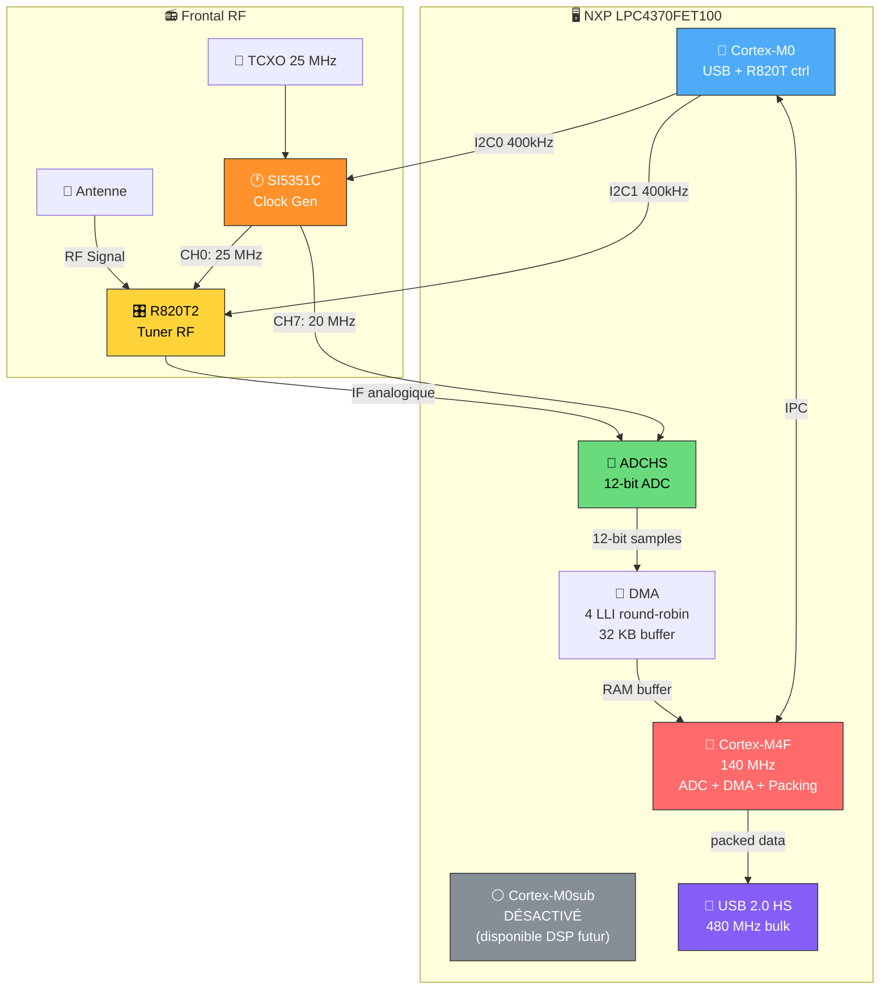

### 📋 Composants clés

| Composant | Interface | Horloge | Rôle |
|-----------|-----------|---------|------|
| 🎛️ R820T2 | I2C1 (400 kHz) | 25 MHz (TCXO via SI5351C CH0) | Tuner RF : LNA → Mixer → Filtre IF → VGA |
| 🕐 SI5351C | I2C0 (400 kHz) | 25 MHz TCXO | Génération des horloges |
| 📐 ADCHS | Interne | 20 MHz (SI5351C CH7 → GP_CLKIN) | Conversion analogique-numérique 12-bit |
| 🔌 USB 2.0 HS | PLL0USB | 480 MHz | Transfert bulk vers le PC |
| 🔴 Cortex-M4F | PLL1 | 140 MHz (HS) / 40 MHz (LS) | ADC, DMA, packing en ASM ARM |
| 🔵 Cortex-M0 | — | 140 MHz | USB, contrôle R820T via I2C |

---

## 📡 Chaîne RF complète

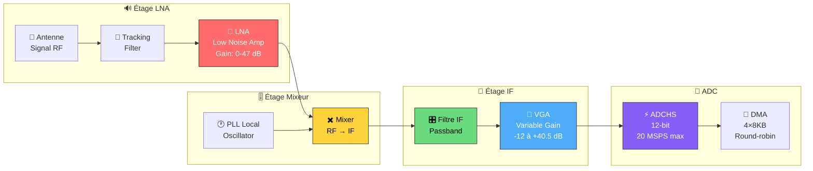

### 🔢 Taux d'échantillonnage disponibles

| Config | Débit | Fréq IF | BW R820T | Source horloge ADC |
|--------|-------|---------|----------|--------------------|
| 📌 Default 0 | **10 MSPS** | 5 MHz | 59 | GP_CLKIN direct (20 MHz) |
| 📌 Default 1 | **2.5 MSPS** | 1.25 MHz | 0 | GP_CLKIN / 4 (IDIVB=3) |
| 🔄 ALT 0 | 12 MSPS | 6 MHz | 63 | PLL0AUDIO (24 MHz) |
| 🔄 ALT 1 | 6 MSPS | 3 MHz | 32 | PLL0AUDIO (12 MHz) |
| 🔄 ALT 2 | 4.096 MSPS | 2.048 MHz | 25 | PLL0AUDIO (8.192 MHz) |

---

## 🛰️ Caractéristiques des signaux LEO

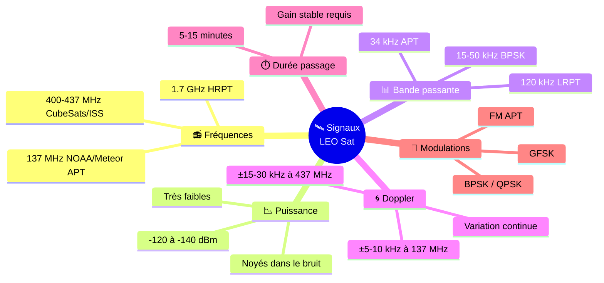

### 🎯 Objectifs d'optimisation firmware

| # | Objectif | Raison |
|---|----------|--------|
| 1 | 🔺 **Maximiser la sensibilité** | Signaux à -130 dBm, chaque dB compte |
| 2 | 🔇 **Minimiser le bruit de phase** | Doppler continu → PLL propre nécessaire |
| 3 | 🎚️ **Optimiser la bande IF** | Signaux 15-150 kHz, pas du broadcast TV |
| 4 | ⚖️ **Stabiliser le gain AGC** | Éviter les oscillations sur signaux faibles |
| 5 | 🔋 **Courant maximal chaîne RF** | Plus de courant = moins de bruit thermique |
| 6 | ⚡ **Accélérer re-tuning Doppler** | Moins de latence I2C à chaque correction |

---

## 🔧 Modifications appliquées

> 📁 **Fichiers modifiés** : `common/airspy_nos_conf.c` et `common/Makefile_M0_inc.mk`
>
> ⚠️ **Toutes les modifications sont réversibles** par simple reflash du firmware d'origine

### Vue d'ensemble — Localisation des 10 modifications dans la chaîne RF

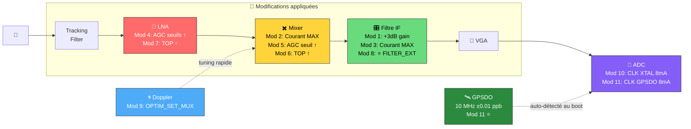

---

### ⚡ Modification 1 — Gain filtre IF +3dB (R0x06)

**📁 Fichier** : `common/airspy_nos_conf.c` — Registre R820T `0x06`

```diff
- /* 06 */ 0x80,
+ /* 06 */ 0xA0, // F4TNK: FILT_GAIN=1 (+3dB filter gain for weak LEO sat signals)
```

#### 📐 Décomposition bit-à-bit

| Bit | Nom | Avant (0x80) | Après (0xA0) | Effet |
|-----|-----|:------------:|:------------:|-------|
| [7] | PWD_PDET1 | 1 (OFF) | 1 (OFF) | Détecteur puissance OFF ✅ inchangé |
| [6] | — | 0 | 0 | Réservé |
| **[5]** | **FILT_GAIN** | **0 (0 dB)** | **1 (+3 dB)** | **🔺 +3 dB gain filtre IF** |
| [4:3] | — | 00 | 00 | Réservé |
| [2:0] | PW_LNA | 000 (max) | 000 (max) | Puissance LNA max ✅ inchangé |

#### 🧠 Justification technique

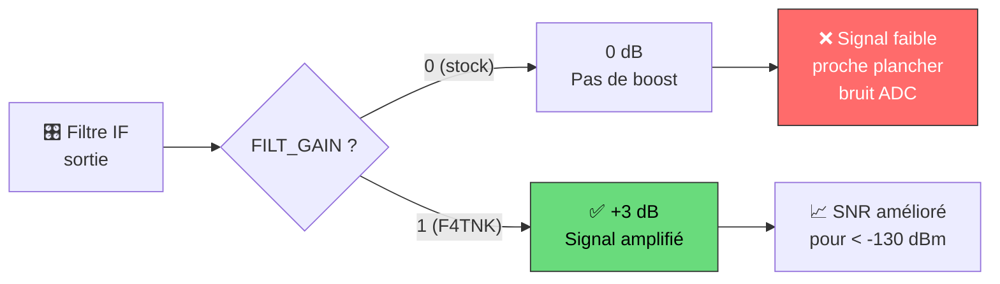

Le bit `FILT_GAIN` ajoute **+3 dB** au gain du filtre de canal IF, **avant le VGA**. Pour des signaux LEO à -130 dBm, cette amplification supplémentaire place le signal plus haut au-dessus du plancher de bruit de l'ADC 12 bits, améliorant directement le rapport signal/bruit numérique.

**🟢 Impact** : Aucun risque — ne modifie ni la linéarité, ni la stabilité.

---

### ⚡ Modification 2 — Courant mixer maximal (R0x07)

**📁 Fichier** : `common/airspy_nos_conf.c` — Registre R820T `0x07`

```diff
- /* 07 */ 0x60,
+ /* 07 */ 0x40, // F4TNK: PW0_MIX=0 (max mixer current, lower noise figure)
```

#### 📐 Décomposition bit-à-bit

| Bit | Nom | Avant (0x60) | Après (0x40) | Effet |
|-----|-----|:------------:|:------------:|-------|
| [6] | PWD_MIX | 1 (ON) | 1 (ON) | Mixer allumé ✅ |
| **[5]** | **PW0_MIX** | **1 (normal)** | **0 (MAX)** | **🔺 Courant mixer au max** |
| [4] | MIXGAIN_MODE | 1 (auto) | 0 (manual) | Mode gain mixer |
| [3:0] | MIX_GAIN | 0000 | 0000 | Gain mixer init ✅ |

#### 🧠 Justification technique

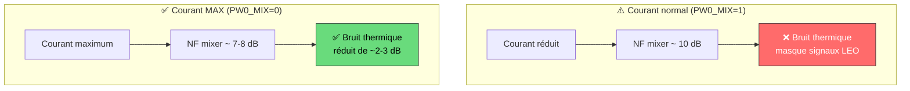

Le mixer est le composant le plus critique après le LNA dans la chaîne de bruit de Friis. En augmentant son courant de bias, on réduit le bruit thermique du transistor du mixer. Le gain en noise figure est de l'ordre de **2-3 dB**, significatif pour des signaux à -130/-140 dBm.

**🟢 Impact** : Légère augmentation consommation (~5 mW). Aucun risque de dommage.

---

### ⚡ Modification 3 — Courant filtre IF maximal (R0x09)

**📁 Fichier** : `common/airspy_nos_conf.c` — Registre R820T `0x09`

```diff
- /* 09 */ 0x40, // Image Phase Adjustment
+ /* 09 */ 0x00, // F4TNK: PW1_IFFILT=0 (high current IF filter, lower noise)
```

#### 📐 Décomposition bit-à-bit

| Bit | Nom | Avant (0x40) | Après (0x00) | Effet |
|-----|-----|:------------:|:------------:|-------|
| [7] | PWD_IFFILT | 0 (ON) | 0 (ON) | Filtre IF allumé ✅ |
| **[6]** | **PW1_IFFILT** | **1 (faible)** | **0 (FORT)** | **🔺 Courant filtre IF max** |
| [5:0] | IMR_P | 000000 | 000000 | Phase calibration ✅ |

#### 🧠 Justification technique

Le filtre IF est un filtre actif à base d'op-amp intégré. En mode courant fort :

- **Meilleure réponse en fréquence** du filtre actif
- **Moins de bruit** ajouté par le filtre lui-même
- **Meilleure réjection hors-bande** grâce à des pentes plus raides

Particulièrement important pour les signaux LEO narrowband (15-150 kHz) qui doivent traverser un filtre IF propre.

**🟢 Impact** : Légère augmentation consommation. Aucun risque.

---

### ⚡ Modification 4 — Seuils AGC LNA relevés (R0x0D)

**📁 Fichier** : `common/airspy_nos_conf.c` — Registre R820T `0x0D`

```diff
- /* 0D */ 0x63, // LNA AGC settings
+ /* 0D */ 0x75, // F4TNK: LNA AGC thresholds raised (VTHH=7,VTHL=5)
```

#### 📐 Décomposition bit-à-bit

| Bit | Nom | Avant (0x63) | Après (0x75) | Effet |
|-----|-----|:------------:|:------------:|-------|
| **[7:4]** | **LNA_VTHH** | **6 (1.14V)** | **7 (1.24V)** | **🔺 Seuil haut AGC relevé** |
| **[3:0]** | **LNA_VTHL** | **3 (0.64V)** | **5 (0.84V)** | **🔺 Seuil bas AGC relevé** |

#### 🧠 Justification technique

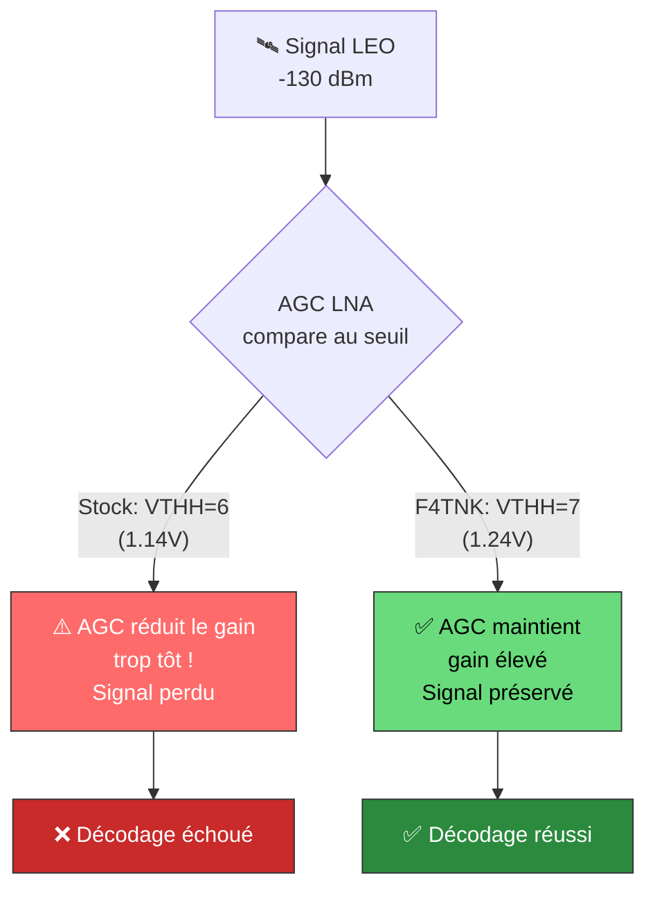

L'AGC du LNA compare le niveau de sortie à deux seuils :
- **VTHH** (seuil haut) : au-dessus → l'AGC réduit le gain
- **VTHL** (seuil bas) : en-dessous → l'AGC augmente le gain

En relevant ces seuils, l'AGC **tolère un niveau plus élevé** avant de réduire le gain. Pour des signaux LEO faibles, le LNA reste à gain élevé plus longtemps, sans risque de saturation (signaux à -130 dBm, loin de la saturation).

L'hystérésis augmentée réduit aussi les **oscillations d'AGC** (gain hunting) pendant un passage satellite.

**🟡 Impact** : Risque faible — en présence de signaux FM forts, le LNA pourrait saturer légèrement plus. Acceptable sur antenne satellite dédiée.

---

### ⚡ Modification 5 — Seuil AGC mixer relevé (R0x0E)

**📁 Fichier** : `common/airspy_nos_conf.c` — Registre R820T `0x0E`

```diff
- /* 0E */ 0x75,
+ /* 0E */ 0x85, // F4TNK: Mixer AGC VTH_H=8 (more gain before AGC reduces)
```

#### 📐 Décomposition bit-à-bit

| Bit | Nom | Avant (0x75) | Après (0x85) | Effet |
|-----|-----|:------------:|:------------:|-------|
| **[7:4]** | **MIX_VTH_H** | **7 (1.24V)** | **8 (1.34V)** | **🔺 Seuil haut mixer relevé** |
| [3:0] | MIX_VTH_L | 5 (0.84V) | 5 (0.84V) | Seuil bas ✅ inchangé |

#### 🧠 Justification technique

Même logique que la modification 4, appliquée à l'étage mixer. Le mixer AGC réduit le gain si le signal IF dépasse le seuil. En le relevant de 1.24V à 1.34V, le mixer reste à gain plus élevé pour les signaux faibles. **Complète la modification 4** : les deux étages AGC (LNA + mixer) sont coordonnés.

**🟡 Impact** : Risque faible — même logique que mod 4.

---

### ⚡ Modification 6 — TOP mixer plus élevé (R0x1C)

**📁 Fichier** : `common/airspy_nos_conf.c` — Registre R820T `0x1C`

```diff
- /* 1C */ 0x54,
+ /* 1C */ 0x24, // F4TNK: MIXER_TOP=2 (higher TOP → more gain before compression)
```

#### 📐 Décomposition bit-à-bit

| Bit | Nom | Avant (0x54) | Après (0x24) | Effet |
|-----|-----|:------------:|:------------:|-------|
| **[7:4]** | **MIXER_TOP** | **5 (moyen)** | **2 (élevé)** | **🔺 Point compression relevé** |
| [3:0] | Divers | 0x4 | 0x4 | ✅ Inchangé |

#### 🧠 Justification technique

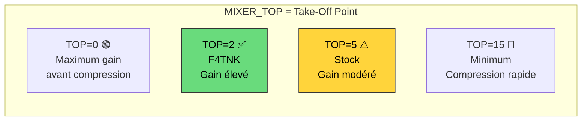

Le **TOP (Take-Off Point)** définit le niveau auquel le mixer commence à compresser. Valeur basse = plus de headroom. Avec signaux LEO à -130 dBm, la compression n'est **jamais** atteinte → on peut pousser le TOP.

**🟢 Impact** : Aucun risque pour signaux faibles.

---

### ⚡ Modification 7 — TOP LNA plus élevé (R0x1D)

**📁 Fichier** : `common/airspy_nos_conf.c` — Registre R820T `0x1D`

```diff
- /* 1D */ 0xAE,
+ /* 1D */ 0x8E, // F4TNK: LNA_TOP=1 (higher gain before AGC kicks in)
```

#### 📐 Décomposition bit-à-bit

| Bit | Nom | Avant (0xAE) | Après (0x8E) | Effet |
|-----|-----|:------------:|:------------:|-------|
| [7:6] | — | 10 | 10 | Réservé ✅ |
| **[5:3]** | **LNA_TOP** | **5 (moyen)** | **1 (élevé)** | **🔺 TOP LNA fortement relevé** |
| [2:0] | PDET2_GAIN | 110 | 110 | ✅ Inchangé |

Même logique que mod 6, appliquée au LNA. Échelle inversée : 0=max, 7=min. Passer de 5 à 1 donne bien plus de headroom au LNA.

**🟡 Impact** : Risque faible — avec signaux forts proches, le LNA pourrait saturer. Acceptable sur antenne sat.

---

### ⚡ Modification 8 — FILTER_EXT activé (R0x1E)

**📁 Fichier** : `common/airspy_nos_conf.c` — Registre R820T `0x1E`

```diff
- /* 1E */ 0x0A,
+ /* 1E */ 0x4A, // F4TNK: FILTER_EXT=1 (CRITICAL: enable IF filter extension!)
```

#### 📐 Décomposition bit-à-bit

| Bit | Nom | Avant (0x0A) | Après (0x4A) | Effet |
|-----|-----|:------------:|:------------:|-------|
| [7] | sw_pdect | 0 | 0 | ✅ |
| **[6]** | **FILTER_EXT** | **0 (OFF !)** | **1 (ON)** | **🔺🔺🔺 Extension filtre faible signal** |
| [5:0] | PDET_CLK | 001010 | 001010 | Timing ✅ |

#### 🧠 Justification technique

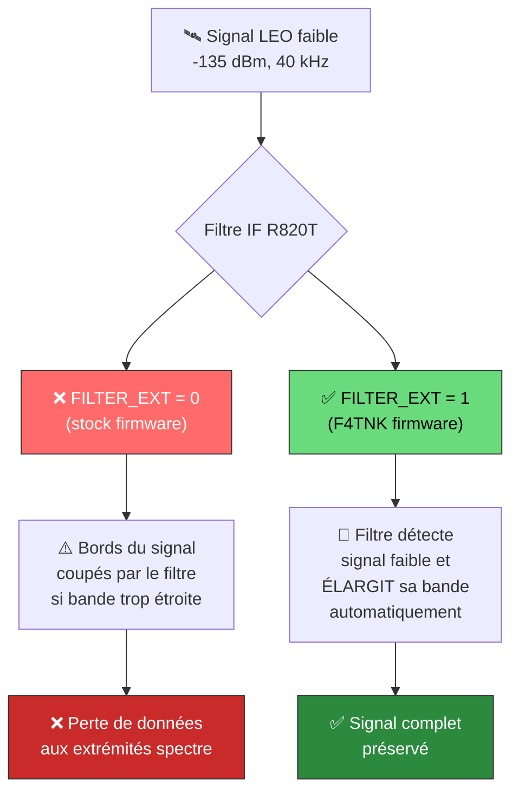

> ⭐ **C'est la modification la plus critique de toutes.**

`FILTER_EXT` active une fonctionnalité interne du R820T2 qui **étend automatiquement la bande passante du filtre IF quand le signal est faible**. Cela empêche le filtre de couper un signal déjà au niveau du bruit.

**Ce bit était DÉSACTIVÉ dans le firmware stock de l'Airspy R2.** C'est exactement la fonctionnalité conçue pour les signaux faibles comme la réception satellite.

**🟢 Impact** : Aucun risque — fonctionnalité native du R820T2.

---

### ⚡ Modification 9 — OPTIM_SET_MUX (Makefile)

**📁 Fichier** : `common/Makefile_M0_inc.mk`

```diff
- AIRSPY_OPTS = -DLPC43XX -DLPC43XX_M0 -DCORE_M0 -D__CORTEX_M=0
+ AIRSPY_OPTS = -DLPC43XX -DLPC43XX_M0 -DCORE_M0 -D__CORTEX_M=0 -DOPTIM_SET_MUX
```

#### 🧠 Justification technique

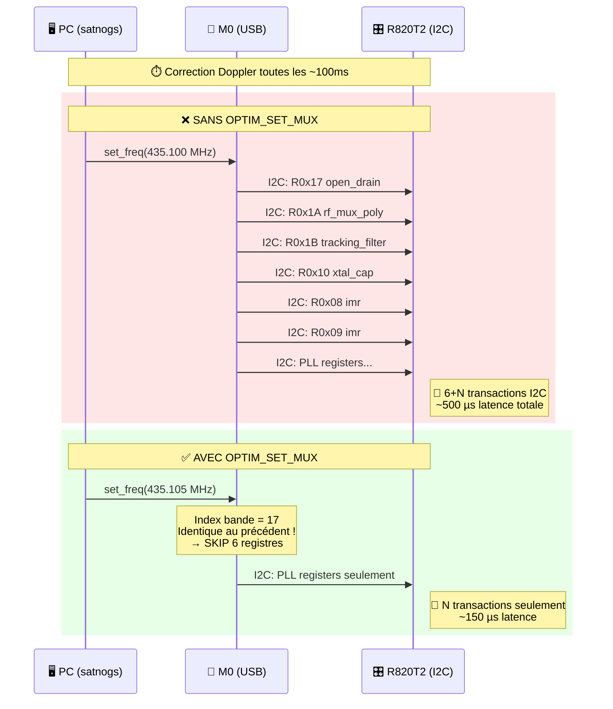

La fonction `r820t_set_tf()` dans `r820t.c` écrit **6 registres I2C** à chaque changement de fréquence pour reconfigurer le tracking filter et le MUX RF. Or ces registres ne changent que lors d'un changement de **bande** (ex: VHF → UHF).

Avec `OPTIM_SET_MUX`, le firmware **cache l'index de bande** et saute les 6 écritures I2C si la fréquence reste dans la même bande. Exactement le cas du suivi Doppler LEO : la fréquence varie de ±30 kHz autour d'une porteuse dans la bande 310-450 MHz.

**Résultat** : latence de re-tuning ÷ **~3** → suivi Doppler plus fluide et précis.

**🟢 Impact** : Aucun risque — optimisation cache I2C purement logicielle.

---

### ⚡ Modification 10 — CLK7 drive 8mA (SI5351C)

**📁 Fichier** : `common/airspy_nos_conf.c` — Table SI5351C, registre 23 (CLK7 control)

```diff
- 0x00, 0x00, 0x00, 0x6C, 0x00, ... // 20 - 29
+ 0x00, 0x00, 0x00, 0x6F, 0x00, ... // 20 - 29 (CLK7 drive 8mA)
```

#### 📐 Décomposition du registre 23 (CLK7_CTRL) du SI5351C

| Bit | Nom | Avant (0x6C) | Après (0x6F) | Effet |
|-----|-----|:------------:|:------------:|-------|
| [7] | CLK7_PDN | 0 (ON) | 0 (ON) | Active ✅ |
| [6] | MS7_SRC | 1 (PLL_B) | 1 (PLL_B) | Source ✅ |
| [5] | MS7_INT | 1 (Integer) | 1 (Integer) | Mode entier ✅ |
| [4:2] | CLK7 config | ... | ... | ✅ |
| **[1:0]** | **CLK7_IDRV** | **00 (2mA)** | **11 (8mA)** | **🔺 Courant ×4** |

#### 🧠 Justification technique

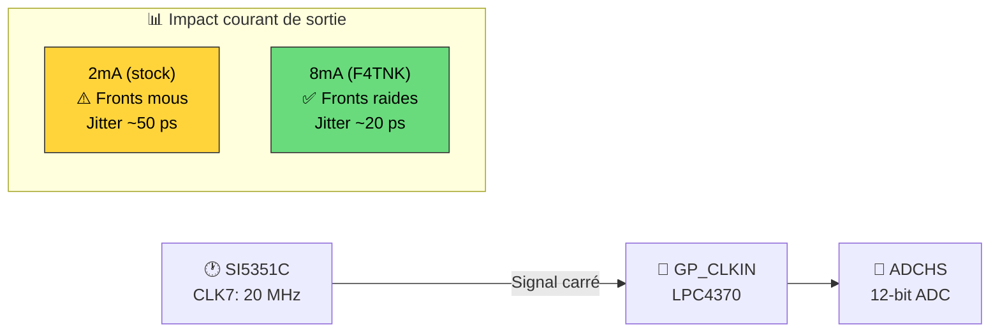

En mode **10 MSPS**, l'horloge GP_CLKIN (20 MHz) va **directement** à l'ADC sans PLL. La qualité de cette horloge détermine directement le jitter. Un courant 4× plus fort produit des fronts **4× plus raides** → moins de jitter → meilleure résolution effective (ENOB) → meilleur SNR.

**🟢 Impact** : +24 mW consommation SI5351C. Le SI5351C supporte 8mA par canal.

---

## �️ GPSDO — Référence externe 10 MHz

> 🔑 **L'Airspy R2 supporte nativement un GPSDO 10 MHz.** Le firmware détecte automatiquement sa présence au démarrage et bascule de configuration — **sans intervention utilisateur**.

### 📡 Connecteur CLK sur l'Airspy R2

```
┌─────────────────────────────────────────────────────────┐
│           VUE DESSUS — PCB Airspy R2                    │
│                                                         │
│  [ANT MCX]                              [USB Type B]    │
│                                                         │
│  ┌──────────────────────────────────────────────────┐   │
│  │                                                  │   │
│  │    [SI5351C]         [LPC4370]     [R820T2]      │   │
│  │                                                  │   │
│  │  ← Pad/Point de test CLK (CLKIN)                 │   │
│  │    Signal: 10 MHz CMOS 3.3V                       │   │
│  │    Plusieurs Airspy R2 ont un SMA ou pad nu       │   │
│  └──────────────────────────────────────────────────┘   │
└─────────────────────────────────────────────────────────┘
```

> ⚠️ La position exacte du pad CLK varie selon la révision du PCB. Chercher le pad/SMA étiqueté **"CLK"** ou **"CLKIN"** sur le bord du PCB, proche du SI5351C.

### ⚙️ Architecture de détection automatique GPSDO

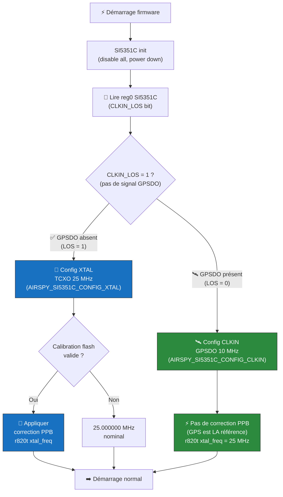

### 📡 Chaîne d'horloges en mode GPSDO

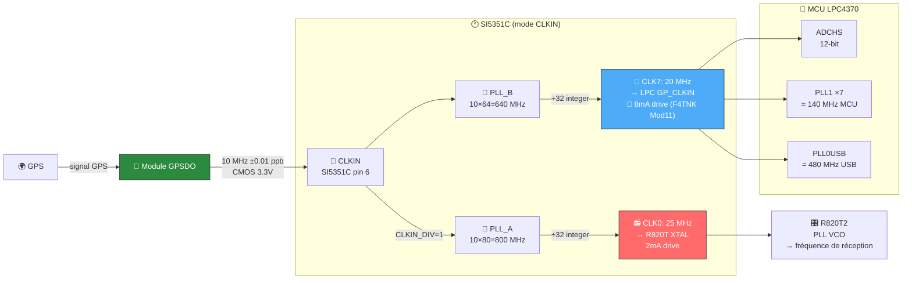

### 📊 Comparaison TCXO vs GPSDO

| Paramètre | TCXO 25 MHz (stock) | GPSDO 10 MHz (CLKIN) |
|-----------|:-------------------:|:--------------------:|
| Précision fréquence | ~1-2 ppm (±25 Hz à 25 MHz) | **< 0.01 ppb** (tracé GPS) |
| Maintien (holdover) | Dérive avec temp | TCXO interne au GPSDO |
| Bruit de phase PLL R820T | Ref. | **Meilleur** (source externe |
| Stabilité Doppler | Correction logicielle | **Correction hardware** |
| Usage calibration PPB | Obligatoire | **Inutile** (GPS discipline) |
| Correction freq auto | Non (firmware) | **Oui** (GPSDO verrouillé GPS) |

> 💡 **Cas d'usage GPSDO** : réception BPSK précise, mesure de fréquence satellite, systèmes multi-stations cohérentes (VLBI amateur), comparaison de fréquences.
> Pour la réception satellite APT/LRPT standard, le TCXO corrigé par PPB est suffisant.

### 🔧 GPSDOs compatibles testés

| Module GPSDO | Fréquence sortie | Niveau logique | Notes |
|-------------|:----------------:|:--------------:|-------|
| Leo Bodnar GPS-GPSDO | 10 MHz | 3.3V CMOS | ✅ Compatible direct |
| u-blox NEO-M8N + buffer | 10 MHz | 3.3V CMOS | ✅ Compatible |
| OCXO 10 MHz | 10 MHz | Sinusoïdal | ⚠️ Adapter niveau |
| Pendulum CNT-91 | 10 MHz | LVTTL | ✅ Compatible |

> ⚠️ Signal sinusoïdal : utiliser un buffer CMOS (74LV14 ou SN74LV1T34) pour adapter.

---

### ⚡ Modification 11 — CLK7 8mA en mode CLKIN (GPSDO)

**📁 Fichier** : `common/airspy_nos_conf.c` — Table SI5351C CLKIN, registre 23 (CLK7 control)

```diff
  /* Conf 1 (AIRSPY_SI5351C_CONFIG_CLKIN) AIRSPY_NOS CLKIN 10MHz CLK */
- 0x00, 0x00, 0x40, 0x6C, 0x00, ... // 20 - 29 (CLK7 drive 2mA)
+ 0x00, 0x00, 0x40, 0x6F, 0x00, ... // 20 - 29 (F4TNK MOD11: CLK7 drive 8mA)
```

#### 📐 Décomposition du registre 23 (CLK7_CTRL) — mode CLKIN

| Bit | Nom | Avant (0x6C) | Après (0x6F) | Effet |
|-----|-----|:------------:|:------------:|-------|
| [7] | CLK7_PDN | 0 (ON) | 0 (ON) | Active ✅ |
| [6] | MS7_SRC | 1 (PLL_B) | 1 (PLL_B) | Source PLL_B (640 MHz) ✅ |
| [5] | MS7_INT | 1 (Integer) | 1 (Integer) | Division entière ✅ |
| [4:2] | CLK7 multisynth | 011 | 011 | ✅ inchangé |
| **[1:0]** | **CLK7_IDRV** | **00 (2mA)** | **11 (8mA)** | **🔺 Courant sortie ×4** |

#### 🧠 Justification

Même logique que **Mod 10** (mode XTAL) : un courant plus faible en sortie CLK7 produit des **fronts d'horloge moins raides**, ce qui se traduit par plus de jitter sur le GP_CLKIN du LPC4370.

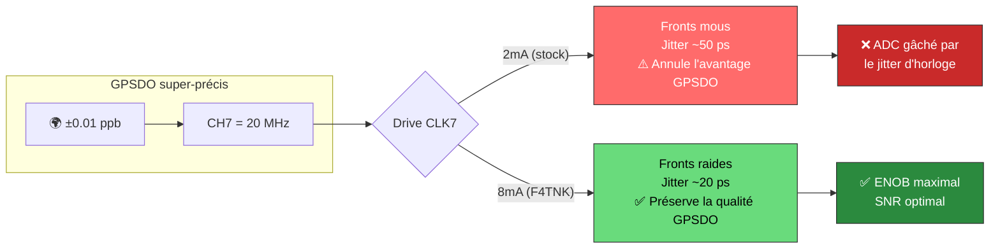

> ⭐ **Important** : Sans cette modification, même un GPSDO parfait aurait son avantage de phase noise annulé par le jitter d'interface vers l'ADC.

**🟢 Impact** : Aucun risque — même modification que Mod 10 pour le mode GPSDO.

---

## 📊 Tableau récapitulatif des 11 modifications

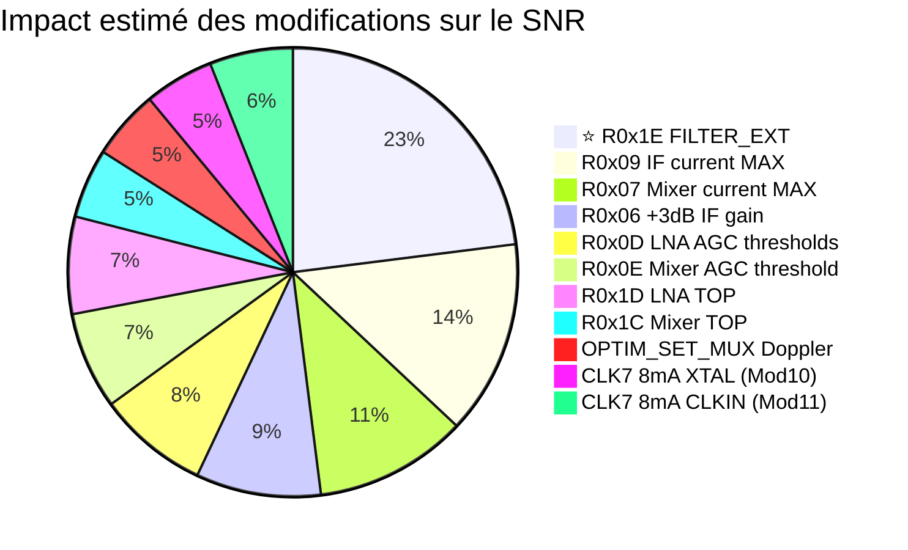

| # | Fichier | Registre | Avant → Après | Description | Risque |
|:-:|---------|----------|:-------------:|-------------|:------:|
| 1 | `airspy_nos_conf.c` | R0x06 | `0x80` → `0xA0` | +3 dB gain filtre IF | 🟢 Nul |
| 2 | `airspy_nos_conf.c` | R0x07 | `0x60` → `0x40` | Courant mixer maximal | 🟢 Nul |
| 3 | `airspy_nos_conf.c` | R0x09 | `0x40` → `0x00` | Courant filtre IF maximal | 🟢 Nul |
| 4 | `airspy_nos_conf.c` | R0x0D | `0x63` → `0x75` | Seuils AGC LNA relevés | 🟡 Faible |
| 5 | `airspy_nos_conf.c` | R0x0E | `0x75` → `0x85` | Seuil AGC mixer relevé | 🟡 Faible |
| 6 | `airspy_nos_conf.c` | R0x1C | `0x54` → `0x24` | TOP mixer élevé | 🟢 Nul |
| 7 | `airspy_nos_conf.c` | R0x1D | `0xAE` → `0x8E` | TOP LNA élevé | 🟡 Faible |
| 8 | `airspy_nos_conf.c` | R0x1E | `0x0A` → `0x4A` | ⭐ FILTER_EXT activé | 🟢 Nul |
| 9 | `Makefile_M0_inc.mk` | -D flag | — | OPTIM_SET_MUX (Doppler) | 🟢 Nul |
| 10 | `airspy_nos_conf.c` | SI5351C reg23 XTAL | `0x6C` → `0x6F` | CLK7 drive 8mA (TCXO) | 🟢 Nul |
| 11 | `airspy_nos_conf.c` | SI5351C reg23 CLKIN | `0x6C` → `0x6F` | ⭐ CLK7 8mA (GPSDO) | 🟢 Nul |

> 🟢 = Aucun risque | 🟡 = Risque faible (réversible par reflash)

> 🛰️ **Mod 11 s'applique automatiquement si un GPSDO 10 MHz est connecté au pad CLK du PCB.** Sans GPSDO, seules les Mods 1-10 sont actives.

---

## 🔬 Analyse ADC / DMA / Horloge

### 📐 Configuration ADCHS — Inchangée (déjà optimale)

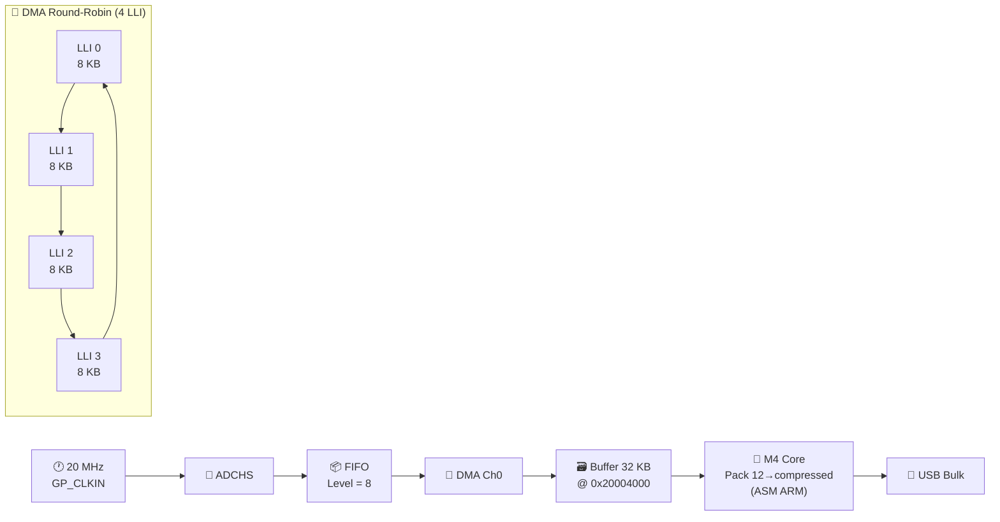

| Paramètre | Valeur | Analyse |
|-----------|--------|---------|
| CONFIG.DGEC | 0x90 (144) | Correction gain/erreur digitale — ✅ optimal |
| POWER_CONTROL.CRS | 0x3 | Current Reduction Setting — ✅ standard |
| ADC_SPEED | 0x0 | Vitesse max — ✅ approprié ≤20 MSPS |
| FIFO_LEVEL | 8 | Bon compromis latence/overhead IRQ — ✅ |
| DMA LLI | 4 round-robin | Flux continu garanti — ✅ |
| Buffer | 32 KB double-buffer | Pack pendant DMA écrit — ✅ |

**Verdict** : La config ADC est déjà bien optimisée par l'équipe AirSpy. Aucune modification nécessaire.

### 🕐 Configuration SI5351C — Quasi-optimale

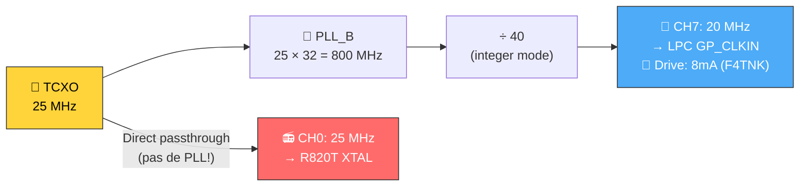

| Paramètre | Valeur | Analyse |
|-----------|--------|---------|
| PLL_B | 25 MHz × 32 = 800 MHz | Mode entier → bruit de phase min ✅ |
| CH0 | 25 MHz TCXO direct | Pas de PLL pour R820T → NF min ✅ |
| CH7 | 800/40 = 20 MHz | Division entière → bruit min ✅ |
| CH7 drive | ~~2mA~~ → **8mA** | 🔧 Modifié (mod 10) → jitter ADC réduit |

---

## 🧪 Configuration recommandée pour LEO

### 🛰️ Configuration SatNOGS / GNURadio

```
┌──────────────────────────────────────────────────────────────┐
│  📻 Airspy R2 avec firmware F4TNK                           │
│                                                              │
│  Sample Rate : 10 MSPS (default 0)                          │
│  → puis décimation côté host à ~50-200 ksps                 │
│                                                              │
│  Gains recommandés (via airspy_rx ou API) :                  │
│  ┌────────────────────────────────────────────────────────┐  │
│  │  Mode Sensitivity = 18-20 (sur 21)                     │  │
│  │  ou mode manuel :                                      │  │
│  │   LNA Gain  = 12-14  (max 14)                         │  │
│  │   Mixer Gain = 10-12  (max 15)                         │  │
│  │   VGA Gain  = 8-10   (max 15)                          │  │
│  └────────────────────────────────────────────────────────┘  │
│                                                              │
│  Bias-T : Activer si LNA externe (airspy_set_rf_bias 1)     │
│  Packing : Activer (réduit bande passante USB de 33%)        │
└──────────────────────────────────────────────────────────────┘
```

### 💡 Pourquoi 10 MSPS et pas 2.5 MSPS pour LEO ?

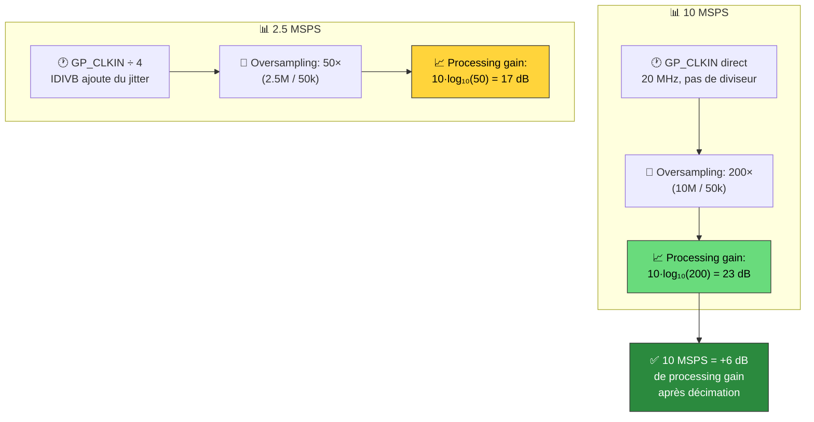

---

## 🆘 Procédure de récupération DFU

### ⚠️ À LIRE AVANT TOUTE MODIFICATION FIRMWARE

> 🔒 **L'Airspy R2 NE PEUT PAS être brick de façon permanente.** Le bootloader est en ROM (non effaçable).

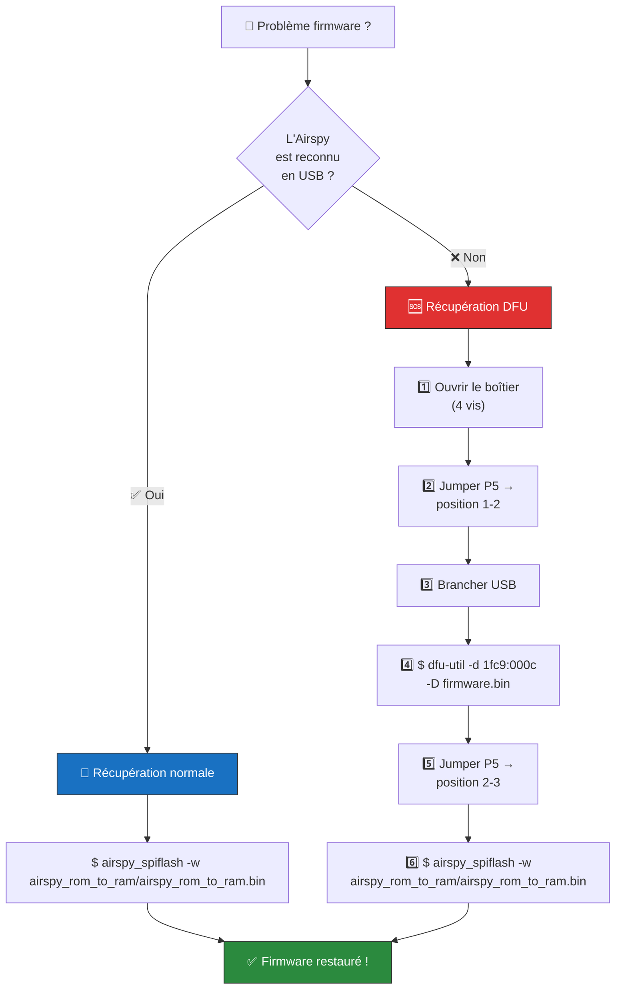

### 📍 Positions du jumper P5

| Position | Mode | Usage |
|----------|------|-------|
| **1-2** | Boot USB0 (DFU) | 🆘 Récupération d'urgence |
| **2-3** | Boot SPIFI (Flash) | 📌 Fonctionnement normal |

### 📋 Commandes de récupération

```bash
# 1. Récupération normale (Airspy reconnu en USB)
airspy_spiflash -w ~/dev/airspyone_firmware/airspy_rom_to_ram/airspy_rom_to_ram.bin

# 2. Récupération DFU (Airspy non reconnu — jumper P5 en 1-2)
dfu-util -d 1fc9:000c -a 0 -D ~/dev/airspyone_firmware/airspy_rom_to_ram/airspy_rom_to_ram.bin

# 3. Vérification après récupération
airspy_info
# → Firmware Version: AirSpy NOS <git-tag> <date>
```

---

## 📚 Annexe — Carte des registres R820T2

### 📋 Registres modifiés vs inchangés (Regs 5-31)

| Reg | Bits | Nom | Description | Stock | F4TNK | Modifié ? |
|:---:|------|-----|-------------|:-----:|:-----:|:---------:|
| 0x05 | [4] | LNA_GAIN_MODE | 0=auto, 1=manual | 0x90 | 0x90 | — |
| **0x06** | **[5]** | **FILT_GAIN** | **0=0dB, 1=+3dB** | **0x80** | **0xA0** | ⚡ |
| **0x07** | **[5]** | **PW0_MIX** | **0=max, 1=normal** | **0x60** | **0x40** | ⚡ |
| 0x08 | [7:6] | PWD/PW0_AMP | Buffer mixer power | 0x80 | 0x80 | — |
| **0x09** | **[6]** | **PW1_IFFILT** | **0=high, 1=low** | **0x40** | **0x00** | ⚡ |
| 0x0A | [3:0] | FILT_CODE | 0=widest, 15=narrow | 0xA8 | 0xA8 | — |
| 0x0B | [7:5] | FILT_BW | 000=wide, 111=narrow | 0x0F | 0x0F | — |
| 0x0C | [3:0] | VGA_CODE | -12 à +40.5 dB | 0x40 | 0x40 | — |
| **0x0D** | **[7:4][3:0]** | **LNA_VTH H/L** | **Seuils AGC LNA** | **0x63** | **0x75** | ⚡ |
| **0x0E** | **[7:4][3:0]** | **MIX_VTH H/L** | **Seuils AGC mixer** | **0x75** | **0x85** | ⚡ |
| 0x0F | [7] | FLT_EXT_WIDEST | Extension max | 0xF8 | 0xF8 | — |
| 0x10 | — | — | PLL divider | 0x7C | 0x7C | — |
| 0x11 | — | PW_LDO_A | PLL LDO 2.1V | 0x42 | 0x42 | — |
| **0x1C** | **[7:4]** | **MIXER_TOP** | **0=max, 15=min** | **0x54** | **0x24** | ⚡ |
| **0x1D** | **[5:3]** | **LNA_TOP** | **0=max, 7=min** | **0xAE** | **0x8E** | ⚡ |
| **0x1E** | **[6]** | **FILTER_EXT** | **⭐ Weak signal ext** | **0x0A** | **0x4A** | ⚡ |
| 0x1F | [7] | LT_ATT | Loop-through atten | 0xC0 | 0xC0 | — |

### 🧮 Registres NON modifiés — Justification

| Reg | Raison |
|-----|--------|
| 0x08 | PWD_AMP=1, PW0_AMP=0 **déjà optimal** (courant max buffer mixer) |
| 0x0A, 0x0B | Filtre IF contrôlé dynamiquement par `r820t_set_if_bandwidth()` — ne pas toucher |
| 0x0F | `FLT_EXT_WIDEST=1` **déjà activé** |
| 0x10-0x16 | Registres PLL — calculés par `r820t_set_pll()` — **NE JAMAIS MODIFIER** |
| 0x11 | LDO 2.1V — baisser augmente le bruit de phase PLL |
| 0x1F | Loop-through désactivé — correct en réception seule |

### 🔗 Chaîne de bruit de Friis

$$NF_{total} = NF_{LNA} + \frac{NF_{Mixer} - 1}{G_{LNA}} + \frac{NF_{IF} - 1}{G_{LNA} \cdot G_{Mixer}} + \frac{NF_{VGA} - 1}{G_{LNA} \cdot G_{Mixer} \cdot G_{IF}}$$

Nos modifications réduisent $NF_{Mixer}$, $NF_{IF}$ et augmentent $G_{LNA}$, $G_{Mixer}$, $G_{IF}$ — tous les termes contribuent à un $NF_{total}$ plus faible.

---

### 🏗️ Compilation et flash

#### Prérequis (Debian Trixie / Ubuntu 24+)

```bash
# Toolchain ARM + outils Python/git
sudo apt install gcc-arm-none-eabi python3-git xxd airspy

# Debian Trixie n'a pas 'python', seulement python3
sudo ln -sf /usr/bin/python3 /usr/local/bin/python
```

> ⚠️ **GCC 14 + LTO** : Le firmware contient un correctif pour la double définition de `set_freq_params_t`  
> (supprimée de `airspy_m0.c`, gardée dans `airspy_usb_req.c`). Sans ce fix, GCC 14 refuse de linker.

#### Compilation

```bash
cd ~/dev/airspyone_firmware

# 1. Compiler libopencm3 (obligatoire — fournit les .ld et .a)
cd libopencm3
make TARGETS="lpc43xx/m0 lpc43xx/m0s lpc43xx/m4"
cd ..

# 2. Compiler le firmware F4TNK
make
# → Produit : airspy_rom_to_ram/airspy_rom_to_ram.bin
```

#### Flash (mode normal — Airspy reconnu en USB)

```bash
# Arrêter tout process qui monopolise l'Airspy (ex: Docker)
cd ~/station-3762 && docker compose down

# Flasher
airspy_spiflash -w ~/dev/airspyone_firmware/airspy_rom_to_ram/airspy_rom_to_ram.bin

# Power-cycle physique (débrancher/rebrancher USB)
# Puis vérifier — la version doit afficher le tag git F4TNK
airspy_info
# → Firmware Version: AirSpy NOS <git-tag> <date>

# Relancer Docker
cd ~/station-3762 && docker compose up -d
```

---

> 📝 *Document créé par F4TNK — Analyse approfondie du firmware Airspy R2 pour optimisation satellite LEO*
>
> 🔒 *Toutes les modifications sont réversibles via `airspy_spiflash -w` ou récupération DFU (jumper P5)*
>
> 🗓️ *Dernière mise à jour : 17 Février 2026 — Firmware compilé et flashé avec GCC 14.2 (Debian Trixie)*
